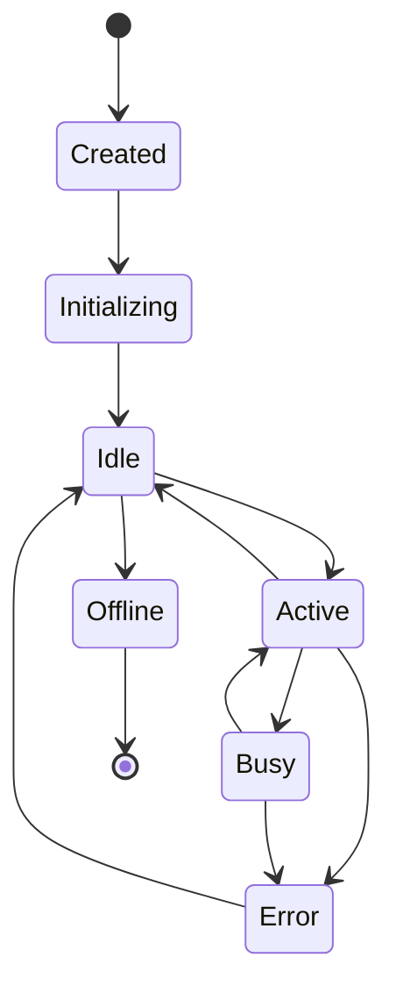

# Agents System

Sistema de gerenciamento e orquestração de agentes inteligentes do Plexo.

## Visão Geral

O sistema de agentes é o coração do Plexo. Cada agente é uma entidade autônoma capaz de:

- Executar tarefas específicas
- Comunicar-se com outros agentes
- Tomar decisões baseadas em contexto
- Aprender com experiências passadas
- Colaborar para resolver problemas complexos

## Tipos de Agentes

### Coordinator Agent

**Responsabilidades:**
- Orquestrar outros agentes
- Distribuir tarefas
- Agregar resultados
- Monitorar progresso

**Capabilities:**
- `planning`: Planejamento de tarefas
- `coordination`: Coordenação de agentes
- `aggregation`: Agregação de resultados

### Worker Agent

**Responsabilidades:**
- Executar tarefas específicas
- Reportar progresso
- Solicitar ajuda quando necessário

**Capabilities:**
- `execution`: Execução de tarefas
- `reporting`: Reportar status

### Monitor Agent

**Responsabilidades:**
- Monitorar sistema
- Detectar anomalias
- Alertar sobre problemas

**Capabilities:**
- `monitoring`: Monitoramento de métricas
- `alerting`: Envio de alertas
- `analysis`: Análise de dados

### Analyzer Agent

**Responsabilidades:**
- Analisar dados
- Gerar insights
- Fazer recomendações

**Capabilities:**
- `analysis`: Análise de dados
- `ml_inference`: Inferência de modelos ML
- `reporting`: Geração de relatórios

## Ciclo de Vida



### Estados

- **Created**: Agente criado mas não inicializado
- **Initializing**: Carregando configurações e conectando
- **Idle**: Pronto para receber tarefas
- **Active**: Processando tarefas
- **Busy**: Ocupado, não pode aceitar novas tarefas
- **Error**: Erro durante execução
- **Offline**: Desconectado

## API

### Criar Agente

```http
POST /api/v1/agents
Content-Type: application/json

{
  "name": "Worker-1",
  "type": "worker",
  "capabilities": ["execution", "reporting"],
  "config": {
    "max_concurrent_tasks": 5,
    "timeout": 300
  }
}
```

### Listar Agentes

```http
GET /api/v1/agents?status=active&type=worker
```

### Obter Detalhes

```http
GET /api/v1/agents/{agent_id}
```

### Atualizar Agente

```http
PATCH /api/v1/agents/{agent_id}
Content-Type: application/json

{
  "status": "idle",
  "config": {
    "max_concurrent_tasks": 10
  }
}
```

### Deletar Agente

```http
DELETE /api/v1/agents/{agent_id}
```

## Comunicação

### XMPP Messages

Agentes se comunicam via XMPP:

```python
# Enviar mensagem
await agent.send_message(
    to="worker-1@localhost",
    content="Execute task #123",
    metadata={"task_id": 123, "priority": "high"}
)

# Receber mensagem
msg = await agent.receive(timeout=10)
if msg:
    task_id = msg.metadata.get("task_id")
    await process_task(task_id)
```

### Behaviors

Agentes usam behaviors para padrões de comunicação:

```python
class RequestBehaviour(OneShotBehaviour):
    async def run(self):
        msg = Message(to="coordinator@localhost")
        msg.body = "Request for task"
        await self.send(msg)
        
        response = await self.receive(timeout=30)
        if response:
            await self.agent.handle_task(response)
```

## Memória

### Short-Term Memory

Armazenada em Redis:
- Contexto da sessão atual
- Tarefas em andamento
- Mensagens recentes
- TTL: 1 hora

### Long-Term Memory

Armazenada em PostgreSQL + KuzuDB:
- Histórico de tarefas
- Aprendizados
- Embeddings de conhecimento
- Persistente

## Monitoramento

### Métricas

- `agent_status`: Status atual do agente
- `agent_tasks_total`: Total de tarefas executadas
- `agent_tasks_success`: Tarefas bem-sucedidas
- `agent_tasks_failed`: Tarefas falhadas
- `agent_response_time`: Tempo de resposta
- `agent_messages_sent`: Mensagens enviadas
- `agent_messages_received`: Mensagens recebidas

### Logs

Todos os agentes logam:
- Início/fim de tarefas
- Mensagens trocadas
- Erros e exceções
- Mudanças de estado

## Configuração

### Exemplo de Configuração

```yaml
agent:
  name: worker-1
  type: worker
  capabilities:
    - execution
    - reporting
  config:
    max_concurrent_tasks: 5
    timeout: 300
    retry_attempts: 3
    retry_delay: 5
  xmpp:
    jid: worker-1@localhost
    password: secret
    server: localhost
    port: 5222
```

## Boas Práticas

1. **Nomeação**: Use nomes descritivos (e.g., `coordinator-main`, `worker-data-processing`)
2. **Capabilities**: Declare todas as capabilities do agente
3. **Timeouts**: Configure timeouts apropriados para cada tipo de tarefa
4. **Error Handling**: Sempre trate erros e reporte falhas
5. **Logging**: Log todas as ações importantes
6. **Monitoring**: Monitore métricas de performance
7. **Testing**: Teste agentes isoladamente e em conjunto

## Troubleshooting

### Agente não conecta

```bash
# Verificar servidor XMPP
docker-compose logs ejabberd

# Verificar credenciais
echo "SELECT * FROM agents WHERE id='agent-1';" | docker-compose exec -T postgres psql -U plexo
```

### Mensagens não chegam

```bash
# Verificar presença
ejabberdctl connected_users

# Verificar logs do agente
docker-compose logs backend | grep agent-1
```

### Performance ruim

```bash
# Verificar métricas
curl http://localhost:9090/api/v1/query?query=agent_response_time

# Verificar carga
curl http://localhost:8000/api/v1/agents/agent-1/stats
```
