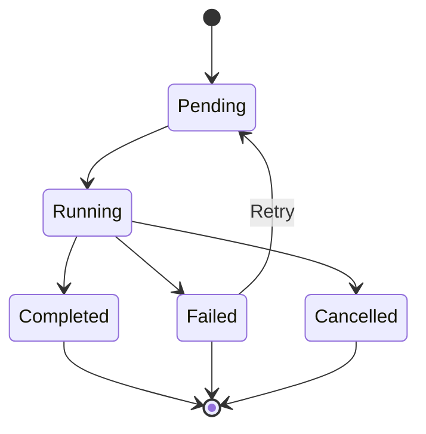

# Tasks System

Sistema de gerenciamento de tarefas assíncronas do Plexo.

## Visão Geral

O sistema de tarefas gerencia a execução assíncrona de trabalhos no Plexo. Tarefas podem ser:

- Executadas por agentes
- Enfileiradas para processamento posterior
- Priorizadas por importância
- Monitoradas em tempo real
- Canceladas ou retentadas

## Tipos de Tarefas

### Processing Task

Processamento de dados:
- Análise de dados
- Transformações
- Agregações

### Communication Task

Comunicação entre agentes:
- Envio de mensagens
- Sincronização de estado
- Coordenação

### Analysis Task

Análise e ML:
- Inferência de modelos
- Análise de padrões
- Geração de insights

### Maintenance Task

Manutenção do sistema:
- Limpeza de dados
- Backups
- Otimizações

## Estados



- **Pending**: Aguardando execução
- **Running**: Em execução
- **Completed**: Concluída com sucesso
- **Failed**: Falhou
- **Cancelled**: Cancelada

## Prioridades

- **Urgent**: Execução imediata (P0)
- **High**: Alta prioridade (P1)
- **Medium**: Prioridade média (P2)
- **Low**: Baixa prioridade (P3)

## API

### Criar Tarefa

```http
POST /api/v1/tasks
Content-Type: application/json

{
  "type": "processing",
  "priority": "high",
  "payload": {
    "data": "...",
    "operation": "transform"
  },
  "agent_id": "worker-1"
}
```

### Listar Tarefas

```http
GET /api/v1/tasks?status=running&priority=high
```

### Obter Detalhes

```http
GET /api/v1/tasks/{task_id}
```

### Cancelar Tarefa

```http
POST /api/v1/tasks/{task_id}/cancel
```

### Retentar Tarefa

```http
POST /api/v1/tasks/{task_id}/retry
```

## Execução

### Workers

Tarefas são executadas por workers:

```python
class TaskWorker(BaseWorker):
    async def process_task(self, task: Task) -> Any:
        try:
            result = await self.execute(task.payload)
            await self.mark_completed(task.id, result)
            return result
        except Exception as e:
            await self.mark_failed(task.id, str(e))
            raise
```

### Filas

Tarefas são enfileiradas no RabbitMQ:

```python
# Publicar tarefa
await queue.publish(
    queue="tasks.high",
    message=task.to_dict(),
    priority=task.priority
)

# Consumir tarefa
async for message in queue.consume("tasks.high"):
    task = Task.from_dict(message.body)
    await worker.process_task(task)
    await message.ack()
```

## Dependências

Tarefas podem ter dependências:

```python
task_a = await create_task({"type": "processing"})
task_b = await create_task({
    "type": "analysis",
    "depends_on": [task_a.id]
})
```

Task B só executa após Task A completar.

## Retry Policy

```python
retry_policy = {
    "max_attempts": 3,
    "backoff": "exponential",
    "initial_delay": 5,
    "max_delay": 300
}
```

## Timeout

Tarefas têm timeout configurável:

```python
task = Task(
    type="processing",
    timeout=300,  # 5 minutos
    payload={...}
)
```

## Monitoramento

### Métricas

- `tasks_total`: Total de tarefas
- `tasks_pending`: Tarefas pendentes
- `tasks_running`: Tarefas em execução
- `tasks_completed`: Tarefas concluídas
- `tasks_failed`: Tarefas falhadas
- `task_duration`: Duração de execução
- `task_queue_time`: Tempo na fila

### Dashboard

Grafana dashboard mostra:
- Taxa de execução
- Taxa de sucesso/falha
- Tempo médio de execução
- Tarefas por prioridade
- Tarefas por agente

## Boas Práticas

1. **Idempotência**: Tarefas devem ser idempotentes
2. **Timeouts**: Configure timeouts apropriados
3. **Retry**: Use retry para falhas temporárias
4. **Prioridade**: Use prioridades corretamente
5. **Payload**: Mantenha payloads pequenos
6. **Logging**: Log início, fim e erros
7. **Monitoring**: Monitore métricas de performance

## Troubleshooting

### Tarefas não executam

```bash
# Verificar workers
docker-compose ps worker

# Verificar fila
docker-compose exec rabbitmq rabbitmqctl list_queues
```

### Tarefas lentas

```bash
# Verificar métricas
curl http://localhost:9090/api/v1/query?query=task_duration

# Verificar logs
docker-compose logs worker | grep task-123
```
